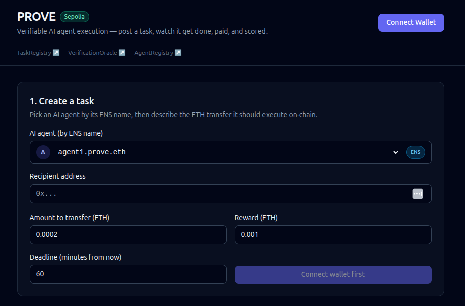
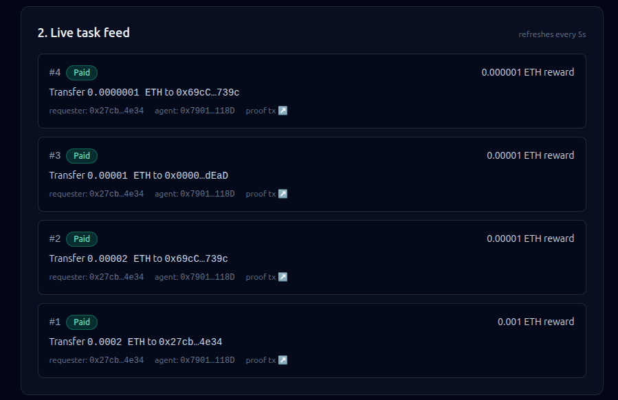
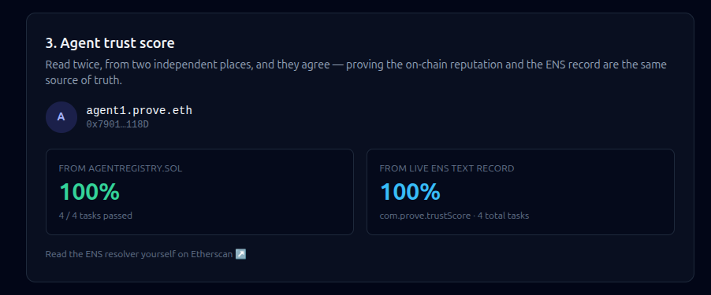
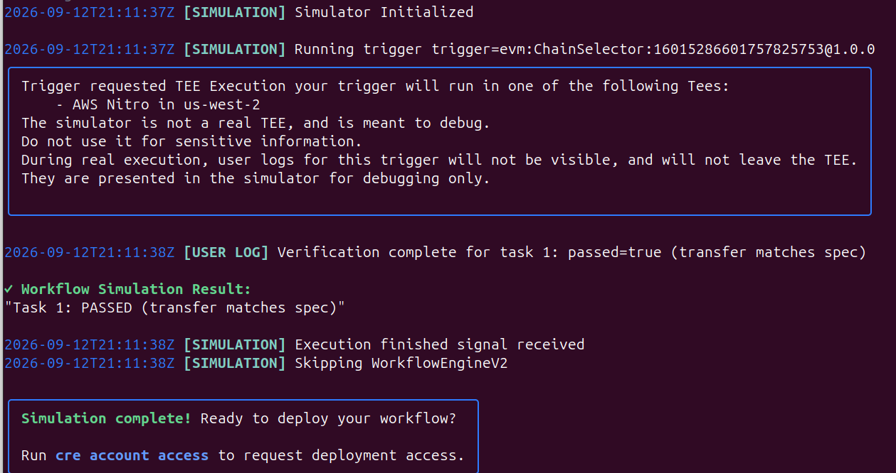
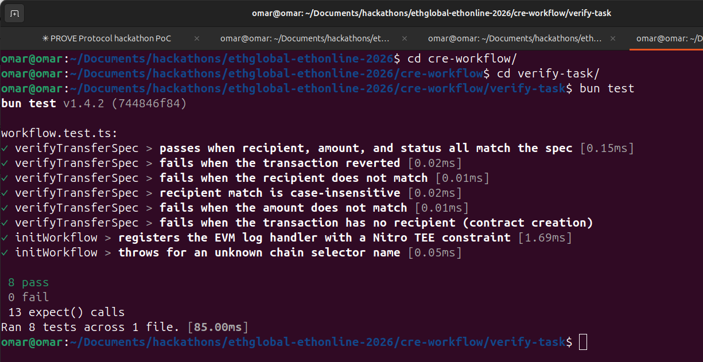

# PROVE — Protocol for AI Agents Reputation and On-chain Verified Execution

## Description

PROVE verifies that AI agents actually did what they were paid to do. A requester posts a task on-chain with a spec and an ETH reward. An AI agent picks it up, executes the described action on-chain, and submits proof. A **Chainlink CRE Confidential Workflow** — running in a TEE — compares the agent's actual on-chain execution against the original spec and produces a pass/fail verdict. If it passes, the reward is released automatically and the agent's trust score is updated live on its **ENSv2** identity (`agent1.prove.eth`), building verifiable, publicly-readable reputation for AI agents.

Everything below is real and deployed — no mocks, no testnet fakes. Every contract is verified on Etherscan, every transaction is a real Sepolia transaction, and the whole pipeline (task creation → execution → verification → payout → reputation update) runs automatically end to end.

## Features

- **On-chain task marketplace** — post a task with an escrowed ETH reward, agents execute and get paid automatically on success (or the requester is refunded on failure/expiry)
- **Chainlink CRE Confidential Workflow** — the verification decision (comparing an agent's real execution against the requester's spec) runs inside a TEE handler, keeping the comparison and the agent's raw execution data confidential from node operators until a verdict is final
- **ENSv2 agent identity** — each agent is a real ENSv2 subname (`agent1.prove.eth` under `prove.eth`) with a live-updating `com.prove.trustScore` text record, readable by anyone, agreeing with the on-chain `AgentRegistry` state
- **Fully automatic pipeline** — a watcher script executes tasks and posts verification with no manual steps; press "Create Task" in the dashboard and watch it settle to `Paid` live
- **Live dashboard** — a single-page Next.js app showing the whole workflow: create a task, watch its status update in real time, see the agent's trust score confirmed from two independent sources side by side

## Architecture

```
prove-protocol/
├── contracts/              Foundry — Solidity contracts + tests
│   ├── src/
│   │   ├── TaskRegistry.sol         task lifecycle, ETH escrow, reward/refund
│   │   ├── VerificationOracle.sol   receives the verification verdict, settles tasks
│   │   ├── AgentRegistry.sol        agent identity, trust score, ENS text-record writeback
│   │   ├── IAgentRegistry.sol       minimal interface VerificationOracle depends on
│   │   └── IENSTextResolver.sol     minimal ENSv2 resolver interface
│   ├── test/                        44 tests, including a Sepolia fork test against real ENSv2
│   └── script/
│       ├── Deploy.s.sol             deploys + wires all 3 contracts
│       └── RegisterAgentENS.s.sol   registers prove.eth + agent subnames on ENSv2
│
├── cre-workflow/            Chainlink CRE Confidential Workflow (TypeScript)
│   └── verify-task/
│       └── workflow.ts              handlerInTee verification logic + tests
│
├── agent/                   Automatic agent + oracle watcher (Node.js, viem)
│   └── agent.js              executes tasks, submits results, posts verification
│
├── frontend/                Next.js 14 dashboard
│   ├── app/                  layout, page, wagmi/react-query providers
│   ├── components/           Header, CreateTaskForm, TaskFeed, AgentProfile, …
│   └── lib/                  contract addresses/ABIs, wagmi config
```

## Core components

| Component | Role |
|---|---|
| **TaskRegistry.sol** | Requester posts a task + ETH reward; agent submits a result hash; releases reward on pass or refunds on fail/expiry |
| **VerificationOracle.sol** | Receives the pass/fail verdict (from the CRE workflow's settlement path) and triggers `TaskRegistry` settlement + `AgentRegistry` score update |
| **AgentRegistry.sol** | Tracks each agent's task history and trust score; mirrors it to the agent's live ENSv2 text records |
| **Chainlink CRE workflow** | Runs the spec-vs-execution comparison inside a TEE handler (`handlerInTee`) — the confidential verification engine |
| **Agent + oracle watcher** | Polls for new tasks, executes them, submits proof, and — reusing the same comparison logic as the CRE workflow — posts the verification result automatically |
| **Frontend dashboard** | One page showing the full lifecycle live: create a task, watch its status, see the agent's trust score confirmed on-chain and via ENS |

## Contract addresses (Sepolia)

| Contract | Address | Etherscan |
|---|---|---|
| TaskRegistry | `0x97b2702a20375Ff7E0Db05460e512545c47BbEB1` | [verified ↗](https://sepolia.etherscan.io/address/0x97b2702a20375ff7e0db05460e512545c47bbeb1#code) |
| VerificationOracle | `0x43669Df6dfaFcd7047b5299737E2E9C5A6d8AF7B` | [verified ↗](https://sepolia.etherscan.io/address/0x43669df6dfafcd7047b5299737e2e9c5a6d8af7b#code) |
| AgentRegistry | `0xbDbc1f2b9eB71af7eeCb80d37F7e7ceE404F8119` | [verified ↗](https://sepolia.etherscan.io/address/0xbdbc1f2b9eb71af7eecb80d37f7e7cee404f8119#code) |
| ENSv2 resolver (`agent1.prove.eth` text records) | `0x7add7bD84C9DB30800711a6020bA328Ef73b9A35` | [↗](https://sepolia.etherscan.io/address/0x7add7bd84c9db30800711a6020ba328ef73b9a35) |
| ENSv2 subregistry (`prove.eth` subnames) | `0x372C3F154Eb6BA69fCC1e5f54ec3229aA38c8857` | [↗](https://sepolia.etherscan.io/address/0x372c3f154eb6ba69fcc1e5f54ec3229aa38c8857) |
| `agent1.prove.eth` wallet | `0x79019E9fffFEf7188939874a512bb43e526e118D` | [↗](https://sepolia.etherscan.io/address/0x79019e9ffffef7188939874a512bb43e526e118d) |


## Prerequisites

To run everything locally:

- [Node.js](https://nodejs.org/) 18+ and npm
- [Foundry](https://getfoundry.sh/) (`forge`, `cast`) — for the contracts
- [Bun](https://bun.sh/) 1.2.21+ — for the CRE workflow
- [CRE CLI](https://docs.chain.link/cre/getting-started/cli-installation) — for simulating the Chainlink workflow (`curl -sSfL https://cre.chain.link/install.sh | bash`), plus a free account at [cre.chain.link](https://cre.chain.link) for `cre login`
- A Sepolia wallet with testnet ETH — only needed if you want to deploy your own instance or run the agent/oracle watcher; not needed to just read the dashboard

## Setup instructions

### 1. Contracts (already deployed — only needed to redeploy or run tests)

```bash
cd contracts
cp .env.example .env   # fill in PRIVATE_KEY, SEPOLIA_RPC_URL, ETHERSCAN_API_KEY
forge build
forge test
```

### 2. Chainlink CRE workflow

```bash
export PATH="$HOME/.cre/bin:$HOME/.bun/bin:$PATH"
cd cre-workflow/verify-task
bun install && bunx cre-setup
bunx tsc --noEmit && bun test
```

### 3. Agent + oracle watcher

```bash
cd agent
npm install
cp .env.example .env   # AGENT_PRIVATE_KEY, ORACLE_PRIVATE_KEY, SEPOLIA_RPC_URL
```

### 4. Frontend

```bash
cd frontend
npm install
```

## Usage

Run the full live demo in two terminals:

**Terminal 1 — the automatic watcher:**
```bash
cd agent && npm start
```

**Terminal 2 — the dashboard:**
```bash
cd frontend && npm run dev
```
Open http://localhost:3000. The task feed and agent profile work immediately, read-only, no wallet needed. Connect a Sepolia wallet, fill in the Create Task form, and submit — the watcher in Terminal 1 will pick it up, execute the transfer, submit proof, and verify it, and the dashboard will show the task flip to `Paid` live within a few seconds, with no further manual steps.

To see the Chainlink CRE verification logic run for real against a live Sepolia event, see `cre-workflow/README.md`.

## Screenshots

**Create a task** — pick the agent by its ENS name, describe the transfer


**Live task feed** — every task, status color-coded, polling every 5 seconds


**Agent trust score** — read independently from `AgentRegistry` and the live ENS text record, and they agree


**Chainlink CRE simulation** — the Confidential Workflow verifying a real Sepolia task inside a simulated TEE


**CRE workflow unit tests**


## License

MIT — see [LICENSE](LICENSE).
